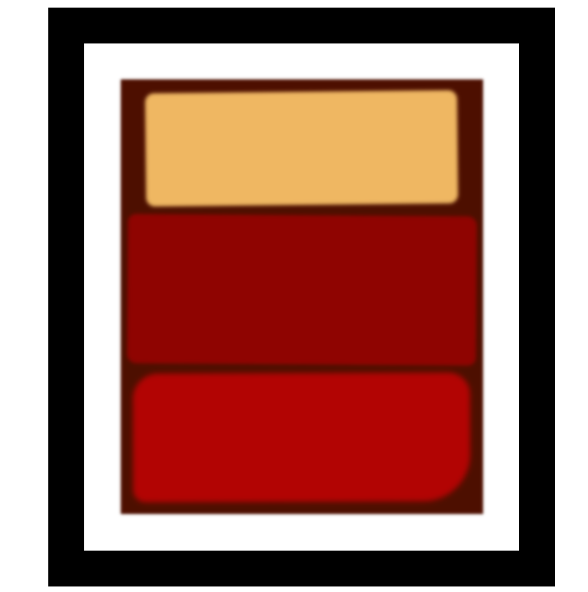

# Rothko Painting

This project is a simple HTML page that mimics a Rothko painting using basic HTML and CSS.

## Preview

## How to View

1. Clone the repository.
2. Open the `index.html` file in your web browser.

## Files

- `index.html`: The main HTML file.
- `styles.css`: The CSS file for styling the HTML elements.